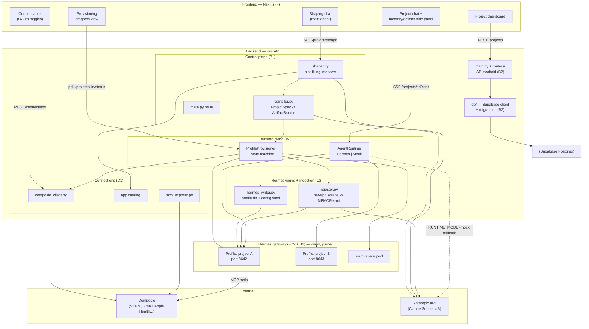
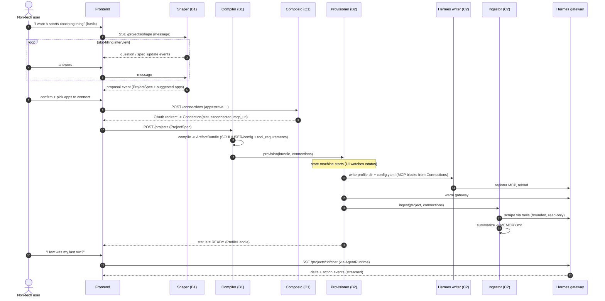
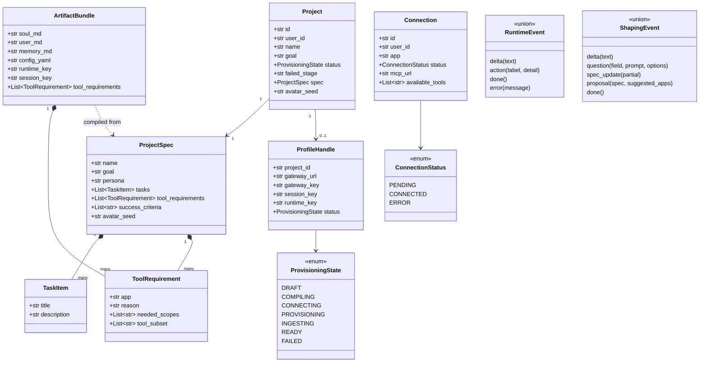
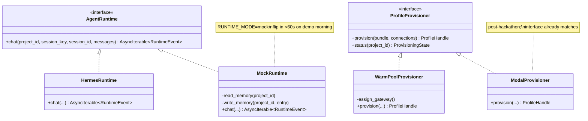
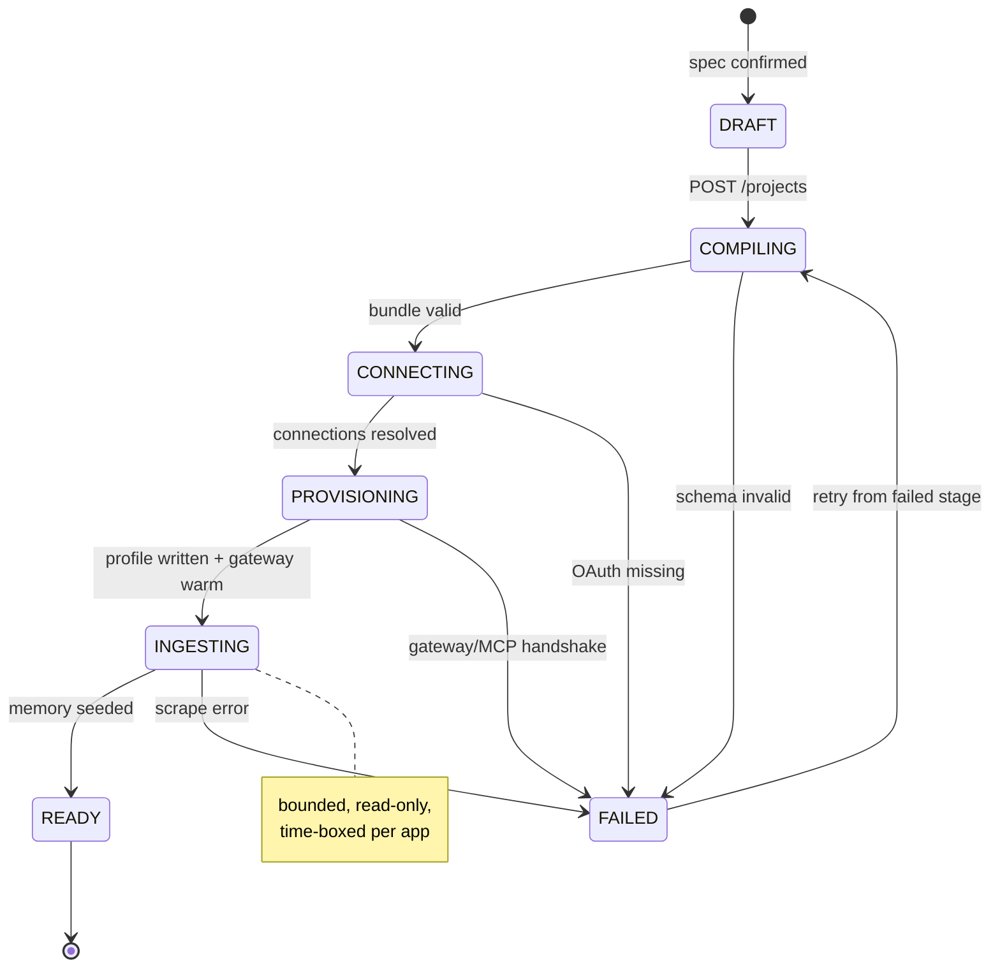
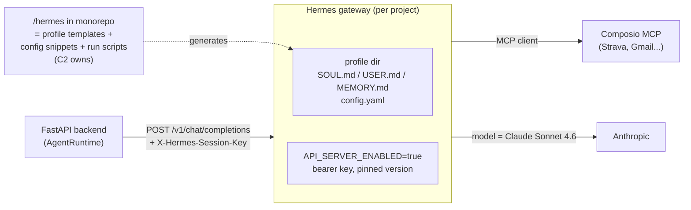

# jarvis.ai — UML & Architecture Diagrams

> All diagrams are Mermaid. They render on GitHub automatically.
> This is the **picture**; `ARCHITECTURE.md` is the **words**; `TEAM_PLAN.md` is the **work**.

The product in one line: a non-technical user talks to a **main agent**, shapes any project by
conversation, and the system compiles that into a real **Hermes profile** wired to the user's real
apps (via **Composio**) with pre-scraped memory — then chats with it. The user can create many
independent projects.

---

## 1. System architecture (components & ownership)

Colors = which team owns the box.
F=Frontend · B1=Control plane · B2=Runtime/Infra · C1=Composio · C2=Hermes wiring/Ingestion.

---

## 2. The creation pipeline (sequence) — "dumb prompt → working agent"

This is your exact flow as typed handoffs. Each arrow's payload is a frozen contract object.

---

## 3. Contracts (class diagram) — the shared spine

These Pydantic models live in `backend/app/contracts/`. **This is the single source of truth.**
The frontend's TypeScript types are auto-generated from these via OpenAPI. Nobody hand-writes types twice.

---

## 4. The swap-able engine (class diagram) — the insurance policy

---

## 5. Provisioning state machine — what the progress UI renders

---

## 6. Where the Hermes repo lives in all this

Hermes is **not** imported as a library and **not** orchestrated over MCP. It runs as **gateway
processes** (one profile per project) that the FastAPI backend talks to over an OpenAI-compatible
REST API. The relationship is one-directional: **Hermes connects out to Composio MCP servers** to
use tools; the backend connects in to Hermes to send chat.

The `/hermes` folder in the repo holds the **template profile**, **config.yaml snippets**, and
**run/warm scripts**. C2's `hermes_writer.py` stamps a new profile dir from the template at
provision time and fills in MCP blocks from the resolved `Connection` objects.
